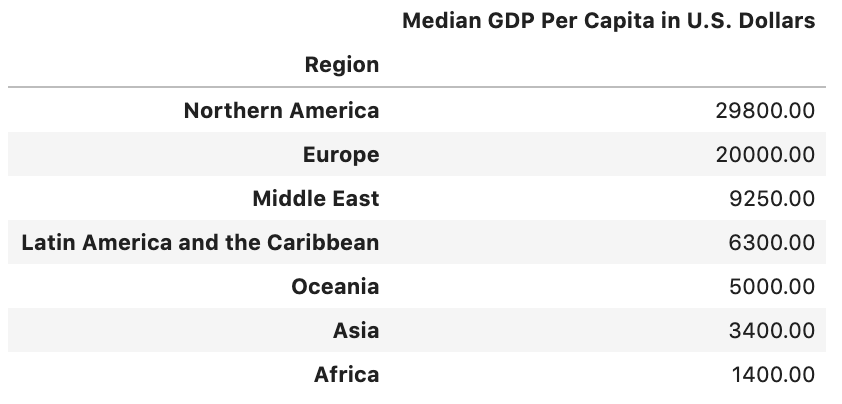
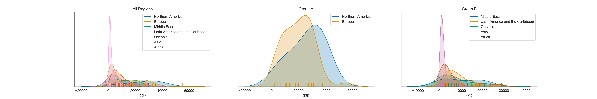
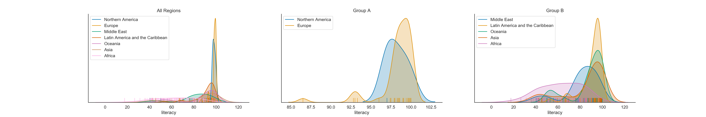
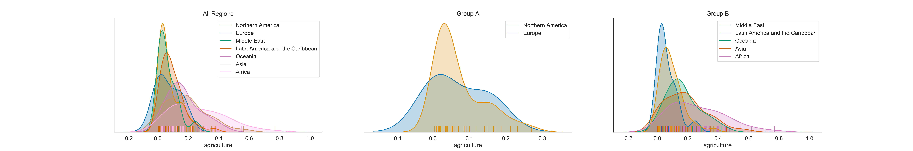
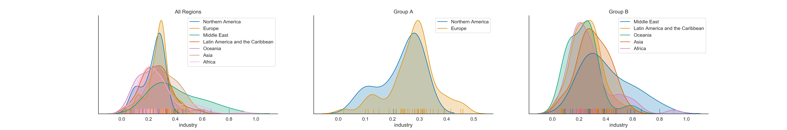
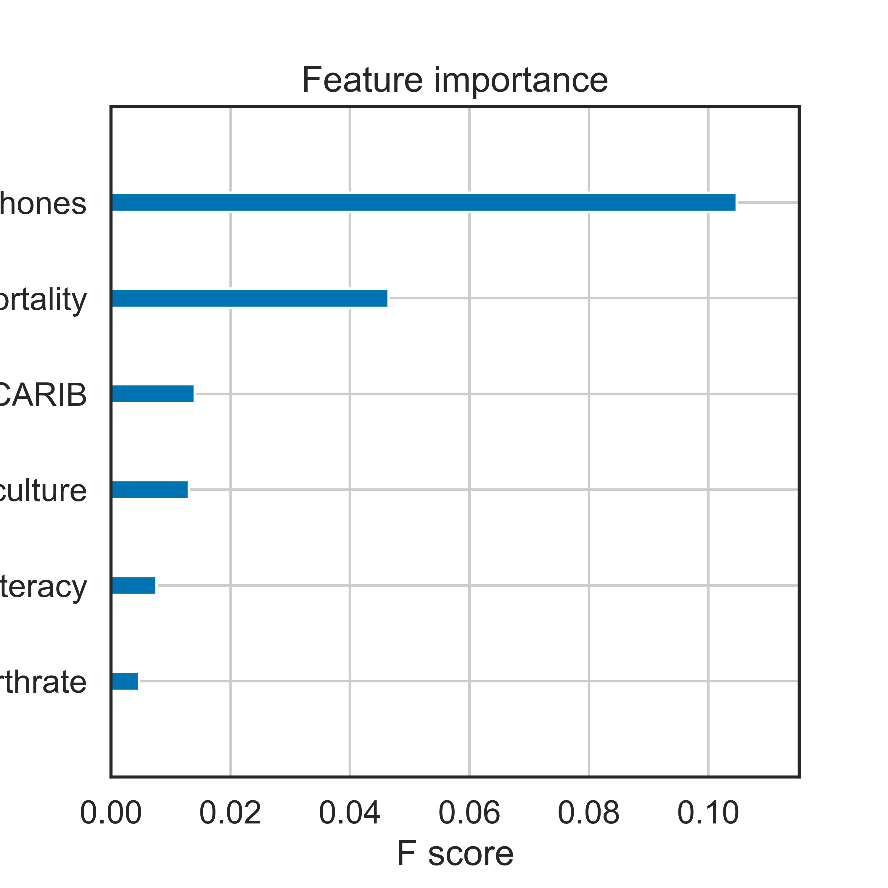

# Exploring Countries of the World Dataset

The world around us is fascinating and diverse. When I found out about the Countries of the World dataset I decided to take this opportunity to dig dipper inside it and answer a few questions which were in my mind:

1. Wealthy vs. Poor Regions: What are the Differences?
2. What Can We Do to Limit Infant Mortality?
3. Machine Learning: What are the most significant predictors determining country's GDP per capita, the key indicator of economic development of any country?

The dataset is the World's fact sheet including information on population, region, area size, infant mortality and more from [CIA World Factbook 2013](http://gsociology.icaap.org/dataupload.html).

Let's address each of the questions and try to find answers based on the dataset.

## 1. Wealthy vs. Poor Regions: What are the Differences?
There is one simgle measure of prosperity used in today's economy: **GDP (Gross Domestic Product)**. In the dataset, GDP is reflected in U.S. dollars per capita. It represents the value of all final goods and services produced within a nation in a given year (the dataset covers 2013 year), converted at market exchange rates to current U.S. dollars, divided by the average population for the same year.

Looking at the world's GDP per capita, we can cluster two groups of regions with a cut at GDP level of 10000: 

- wealthier ones (Northern America and Europe) and 
- poorer ones (Middle East, Latin America and the Caribbean, Oceania, Asia, Africa). 

In the poorer regions there are also wealthy countries (like Australia in Oceania with GDP of 29000 or Hong Kong and Japan in Asia with GDP above 28000) that is why focusing on a question related to poorer countries in regions, I have used median which is less prone to outliers. Let's call the wealthier regions **Group A** and others **Group B**.

Going further, some interesting questions arise: What are the distinguishing traits of wealthy (A) and poor (B) regions? What should the poor regions focus on to become wealthier? Let's find out what our data say.

Within the Group A regions, Eastern European countries are the poorest ones which is represented by a hump in the left slope of the Europe's distribution. North America countries seem to be more left skewed towards higher GDP. The majority of Group A countries have GDP above 20000. The The Luxemburg's GDP of 55100 stays above all. This is a very good result for this small European country. 

The Group B regions tend to have right-skewed distributions of countries' GDP with Africa having the lowest GDP of all, then Asia and the best of them Middle East. The long right tail represents the wealthier countries withing the poorer regions like Australia, Hong Kong, Japan or Singapure having GDP on the European level. For the Group B regions, we will focus on poorer countries only to see what should be their economical focus in order to catch up the Group A regions or leading countries within Group B.

So, what are exactly the differences in the world's data regarding wealthier and poorer regions? Let's find out by comparing selected economic attributes: literacy, agriculture, industry, and service. 

#### Literacy

Literacy is the ability to read and write.

Literacy seems to be one of the big differentiators. Group A regions has literacy level above 85% of the population with the worst results by Albania (86.5%), Malta (92.80%) and Serbia (93%), whereas Group B starts from 17.5% (Niger) and many other African, Middle East or Oceania countries way below 80%.

The Group B should focus on improving education level of their population leading to more innovative societes. More educated people would have easier access to knowledge (the Internet, books). It would be easier to them to exchange and implement other nations' ideas leading to prosperity and further educational growth.

#### Agriculture

The agriculture world data indicator is percentage of GDP sector composition ratio for agriculture economy sector. Agriculture indicator, together with the other two: Industry and Service, constitute 100% of GDP of a country.

Agriculture in more developed countries takes only a fraction of a small portion of their GDP per capita. All Group A countries have agriculture indicator value below 27% with the more developed countries below the ratio of 5%.

In the Group B, we can notice that the percentage of GDP agriculture ration is more significant. Countries like Liberia (77%), Somallia (65%) or Guinea-Bissau (62%) take the lead here.

The low ratio does not necessarily mean that more developed countries have worse agriculture indicators, it rather means that other economy sectors (Industry or Service) take precedence in influencing their GDP being more profitable comparing to agriculture.

The Group B countries should focus on developing innovative industry and service sector to become more competitive. Having stronger industry and service sectors would also influence positively agriculture with more modern, productive an healhty treatment. 

#### Industry

The Industry indicator shows the percentage of GDP sector composition ratio for industry economy sector.

Within groups, the data distributions overlap significantly meaning the economies of the regions in terms of industry sector are within similar range (with a mean of 0.25 for Group A and 0.28 for Group B). Between the two groups, most of countries have similar values ranging from 2% (Jersey) to 50% (Ireland), nevertheless there is a long right tail within the Group B countires showing countries with the metric above 50%, like Samoa, (58%), Angola (66%), Qatar (80%) or Equatorial Guinea (91%).

From this high-level and simplified analysis, one could derive that more service-oriented economy would be the proposed direction for above 40% countries. The strong industry indicator in Group B countries may indicate that these countries are already on their way to get there, because the service-centric economies are also related to wealthier nations (positive correlation of 0.51 between GDP and Service economic factor). One way of becoming wealthier as a nation is to start with a strong industry sector.

#### Service

A service economy is a nation that generates more value from services than other sectors such as agriculture and manufacturing.

Advanced economies are locked in a long term trend whereby services are becoming a greater percentage of economic output. In Europe, the least service developed economy is Ukraine (36%), in Northern America St. Pierre & Miquelon (57%). In Asia the index starts with the value of 0.26 (Laos), in Oceania 0.27 (Papua New Guinea), in Africa with 0.06 (Equatorial Guinea), Middle East with 0.20 (Qatar) and Latin America and the Caribbean with 0.42 (Trinidad & Tobago).

On the other side most service-oriented countries (in both Groups) are represented with values from above 70%.

### Conclusion

To summarize, the most successful regions in terms of wealth (GDP per capita) are (almost) 100% literate. Their nations seem to be more uniform in terms of the indicators. They have very strong service focused economy ratio and depending on different factors (like geography or size) their second characteristics are more agriculture or industry oriented. 

The poorer regions, although having very stron nations as representatives (Australia, Japan, Hong Kong, to name a few) are more varied with a significant portion of countries with agriculture or industral economies and much work to do in terms of improving their nations' literacy.

In order to catch up, the Group B regions should focus on education to speed up the development process and take the best technologies, environment-friendly approaches and economical mindsets from the Group A regions (plus leading nations in terms of GDP from Group B). In most cases they might have to take a long journey from pure agricultural societes, through industrial ones to the ones where the service sector plays the main role.

As a last note, it is interesting to see how different regions on the same continent can be internally. For example, considering Europe, the West European countries have generally better GDP indicators than East European countires, which is due to longer period of prosperity, democratic or republic systems and consideration for the law. This draws the conclussion that in greater pace and chance of achieving success in building economical prosperity cultural, social and especially political situation plays an important role.

### 2. What can we do to limit infant mortality?

Infant mortality is defined as the death of young children under the age of 1. This death toll is measured by the Infant Mortality Rate (IMR), which is the number of deaths of children under one year of age per 1000 live births. In the 21st century, in the age of robotics, genetics and sophisticated healthcare the infant mortality rate should be really low. But there are still countries in the world where on average 160 or more per 1000 infants die during the first year after birth (i.e. Angola - 191, Afganistan - 163 on average). This is especially true for regions like Asia and Africa.

Based on the world dataset, infant mortality is strictly related to the GDP and rates of different economical models representing a give nation. In general, nations with lower GDP, greater ratios of agriculture sector, lower ratios of service sector and lower literacy level have greater infant mortality. 

The more poor the nation is, the greater chance of premature mortality exists. The more educated and wealthy the nation is, the more chance infants have to survive. It may sound obvious, but poorer nations have greater birth rate in general which also results in greater ratio of infant mortality. 

Looking at the world maps of mortality and gdp we see they are like inverse of each other. Countries with greater GDP have lower infant mortality and vice versa.

In this context, it is important to that richer and more developed countries help the poorer ones both economically and especially in terms of education. The more aware and enlightened people become, the bigger care they will put into proper health-care infrastructure and treatment (vaccination, healthy life style and medical examinations during pregnancy, breastfeeding, etc.), and as a result the more chance to survive infants will be given.

## 3. What are the most significant predictors determining country's GDP per capita, the key indicator of economic development of any country?

The most important features used by a XGBoost model used to predict GDP are: phones (the wealthest nation is the more phones it has), infant mortality (poorer countries have greater IMR than wealthier countries), the fact that a country is in Latin America region (I do not know why this one is so important), the agriculture score, the level of literacy and birthrate. Using these features, the XGBoost model was able to get R squared score of 0.79 on test data.

zakonczenie ogolne?